# Quant Machine Learning Research Architecture

一个模块化、流水线式的 A 股量化研究框架。支持多模型、多数据源，覆盖从原始 OHLCV/因子数据到模型训练与评估的完整流程，所有实验可复现。

---

## 目录

- [1. 框架架构](#1-框架架构)
  - [1.1 数据流水线](#11-数据流水线)
  - [1.2 目录结构](#12-目录结构)
  - [1.3 Model Triple 设计模式](#13-model-triple-设计模式)
  - [1.4 注册表与配置驱动](#14-注册表与配置驱动)
  - [1.5 内置模型](#15-内置模型)
- [2. 新用户指南——新数据、新模型](#2-新用户指南新数据新模型)
  - [示例数据集下载](#示例数据集下载)
  - [2.1 使用已有模型训练自己的数据](#21-使用已有模型训练自己的数据)
  - [2.2 从零搭建全新模型](#22-从零搭建全新模型)
  - [2.3 详细文档索引](#23-详细文档索引)
- [3. 配合 AI 编程 Agent 使用](#3-配合-ai-编程-agent-使用)
  - [3.1 为什么 AI Agent 能直接上手](#31-为什么-ai-agent-能直接上手)
  - [3.2 推荐工作流](#32-推荐工作流)
  - [3.3 示例 Prompt](#33-示例-prompt)

---

## 1. 框架架构

### 架构总览图

下面两张图分别从静态和运行时两个视角展示框架架构（如果在页面上显示不清楚，可以点击图片或下载 SVG 文件查看完整大图）：

**Module View（静态架构）——包与依赖关系：**



**Component & Connector View（运行时数据流）——一次完整 pipeline 执行：**



### 1.1 数据流水线

框架通过 5 步流水线处理数据，每一步可独立运行，并支持断点续跑。

```
 原始数据 (OHLCV parquet + 因子 parquet)
     │
     ▼
 ┌──────────────────────────────────────────┐
 │  Step 1: build_assets                    │
 │  将原始文件标准化为统一资产表            │
 │  (instrument_master, trading_calendar,   │
 │   daily_bars, factor_values,             │
 │   status_intervals)                      │
 └──────────────────┬───────────────────────┘
                    ▼
 ┌──────────────────────────────────────────┐
 │  Step 2: build_panel_base                │
 │  全交叉 (所有交易日 × 所有股票)          │
 │  生成统一底板 panel_base，包含            │
 │  特征列 + 状态列                         │
 └──────────────────┬───────────────────────┘
                    ▼
 ┌──────────────────────────────────────────┐
 │  Step 3: build_target                    │
 │  计算标签 (return_c0c1, momentum_cls     │
 │  等)，输出为独立的 target_block 文件     │
 └──────────────────┬───────────────────────┘
                    ▼
 ┌──────────────────────────────────────────┐
 │  Step 4: build_view                      │
 │  将底板 + 标签转换为模型所需的格式       │
 │  (如 LSTM 用 3D memmap,                  │
 │   LightGBM 用 2D numpy array)           │
 └──────────────────┬───────────────────────┘
                    ▼
 ┌──────────────────────────────────────────┐
 │  Step 5: train                           │
 │  按时间切分训练/验证/测试集，            │
 │  训练模型，支持 early stopping、         │
 │  refit 和 test 评估                      │
 └──────────────────────────────────────────┘
```

**一条命令跑完全流程**，支持自动断点续跑：

```bash
python scripts/run_pipeline.py --config configs/your_config.yaml
```

### 1.2 目录结构

```
framework/
├── configs/                         # 实验配置（每个实验一个 YAML）
│   ├── LSTM_MTL.yaml
│   └── lgbm_alpha158_fund.yaml
│
├── engine/                          # 核心代码包
│   ├── assets/                      #   原始数据 → 标准化资产表
│   ├── core/                        #   常量、异常、类型定义
│   ├── io/                          #   PathManager、parquet 读写、panel reader
│   ├── models/                      #   BaseModel + 注册表 + impl/
│   │   └── impl/
│   │       ├── lstm_mtl/            #     LSTM 多任务模型
│   │       └── lgbm/               #     LightGBM 排序模型
│   ├── panel/                       #   底板构建 + 校验
│   ├── schema/                      #   列名规范、标签契约、校验器
│   ├── sources/                     #   原始数据源读取器 (OHLCV、因子)
│   ├── targets/                     #   标签 recipe + 注册表 + 引擎
│   │   └── recipes/                 #     return_nd.py (公式化收益), momentum_cls.py
│   ├── training/                    #   BaseTrainer + 回调 + 时间切分 + impl/
│   │   └── impl/
│   │       ├── lstm_mtl/            #     LSTM 训练器 + 评估器
│   │       └── lgbm/               #     LightGBM 训练器
│   └── views/                       #   BaseViewBuilder + impl/
│       └── impl/
│           ├── lstm_mtl/            #     3D memmap 视图构建器
│           └── lgbm/               #     2D numpy 视图构建器
│
├── scripts/                         # 可执行入口
│   ├── run_pipeline.py              #   全流程一键运行（带断点续跑）
│   ├── build_assets.py
│   ├── build_panel_base.py
│   ├── build_target.py
│   ├── build_view.py
│   └── train.py
│
├── guidance/                        # 详细文档（见 §2.3）
│   ├── guidance0_quick_start/
│   ├── guidance1_panel_base_and_assets/
│   ├── guidance2_label_target_building/
│   ├── guidance3_view_building/
│   └── guidance4_model_and_training/
│
└── data/
    ├── processed/                   # 中间产物
    │   ├── assets/                  #   instrument_master, trading_calendar 等
    │   ├── panel/                   #   panel_base.parquet
    │   ├── targets/<name>/          #   每个标签的 target_block.parquet
    │   └── views/<model>/memmap/    #   模型视图 + meta.json
    └── training_result/<exp>/       # 训练输出
        ├── checkpoints/             #   best.pt / model.txt
        ├── log.csv                  #   逐 epoch 训练日志
        └── config.json              #   配置快照（可复现）
```

### 1.3 Model Triple 设计模式

框架中每个模型由**三个组件**组成，一起注册：

```
┌─────────────────────────────────────────────────────────────────┐
│                        Model Triple                             │
│                                                                 │
│   Model (BaseModel)           定义网络结构                      │
│   ViewBuilder (BaseViewBuilder)    将数据转换为模型所需格式     │
│   Trainer (BaseTrainer)       拥有完整的训练循环                │
│                                                                 │
│   注册方式：                                                    │
│   register_model("name", ModelClass, ViewClass, TrainerClass)   │
└─────────────────────────────────────────────────────────────────┘
```

这种分离意味着：

- **Model** 只关心网络结构（层、前向传播），不关心怎么加载数据或训练。
- **ViewBuilder** 将共享的 `panel_base` + `target_block` 转换为模型需要的格式（memmap、numpy 等）。不同模型可以用不同方式读取相同的底层数据。
- **Trainer** 拥有完整的训练循环——损失函数、优化器、调度策略、评估指标。不同模型的训练逻辑完全独立。

### 1.4 注册表与配置驱动

模型和标签均通过**名称注册**。一个 YAML 配置文件驱动整个实验：

```yaml
model:
  name: "lstm_mtl"          # ← 从注册表查找 (Model, ViewBuilder, Trainer) 三元组
  params:
    hidden_size: 128
  label_roles:
    regression: "return_c0c1"
    classification: "momentum_cls"

targets:
  - name: "return_c0c1"     # ← 从标签注册表查找 ReturnRecipe
  - name: "momentum_cls"
```

切换模型不需要改代码——只改配置。

### 1.5 内置模型

| 模型 | 配置名 | 类型 | 说明 |
|------|--------|------|------|
| LSTM 多任务 | `lstm_mtl` | PyTorch LSTM | 回归（收益预测）+ 分类（动量类别），带输入特征门控和 L1 稀疏。支持 MSE 或 LambdaRank NDCG 损失。 |
| LightGBM 排序 | `lgbm_rank` | LightGBM | 基于梯度提升的 LambdaRank 排序模型，用于截面股票排序。 |

---

## 2. 新用户指南——新数据、新模型

### 示例数据集下载

内置模型（`lstm_mtl`、`lgbm_rank`）基于 2019–2025 年 A 股数据开发和测试，包含日频 OHLCV 行情和 alpha158/fund 因子特征。下载后可直接复现示例配置：

> **百度网盘：** https://pan.baidu.com/s/1yIGTYrIe21nmIMGytfFmeg?pwd=6h8a
>
> 提取码：`6h8a`

下载解压后，将 config 中的 `data.raw_ohlcv_dir` 和 `data.raw_factor_dir` 指向解压目录即可。

### 2.1 使用已有模型训练自己的数据

如果你只是想用已有模型（如 `lstm_mtl` 或 `lgbm_rank`）训练自己的数据：

**第一步：** 准备日频 parquet 数据（或直接使用[示例数据集](#示例数据集下载)）：
- OHLCV 行情：必须包含 `date, symbol, open, high, low, close, volume` 列
- 因子数据：必须包含 `date/datetime, instrument/order_book_id, feature.*` 列

**第二步：** 复制并编辑配置文件：
```bash
cp configs/LSTM_MTL.yaml configs/my_experiment.yaml
# 修改数据路径、日期范围、模型参数
```

**第三步：** 运行：
```bash
python scripts/run_pipeline.py --config configs/my_experiment.yaml
```

流水线会自动依次执行资产构建、底板生成、标签计算、视图构建和训练。如果中途失败，重新运行相同命令即可从上次失败的步骤继续。

### 2.2 从零搭建全新模型

添加新模型需要实现 **Model Triple**（3 个文件）：

```
engine/models/impl/your_model/model.py       ← 继承 BaseModel
engine/views/impl/your_model/view.py         ← 继承 BaseViewBuilder
engine/training/impl/your_model/trainer.py   ← 继承 BaseTrainer
```

然后在 `engine/models/registry.py` 中注册：

```python
register_model("your_model", YourModel, YourViewBuilder, YourTrainer)
```

创建配置文件，设置 `model.name: "your_model"`，运行流水线即可。

完整的代码模板和契约说明请阅读 [Quick Start Guide](guidance/guidance0_quick_start/QUICK_START_GUIDE.md)。

### 2.3 详细文档索引

`guidance/` 文件夹包含框架每个部分的详细文档：

| 文档 | 内容 |
|------|------|
| [guidance0 — Quick Start](guidance/guidance0_quick_start/QUICK_START_GUIDE.md) | 从零到完成训练的完整教程。包含新模型的代码模板和所有基类契约参考。**从这里开始。** |
| [guidance1 — 底板与资产](guidance/guidance1_panel_base_and_assets/PANEL_BASE_GUIDE.md) | 原始数据如何变成 `panel_base.parquet`。列名规范、状态标志、schema 校验。 |
| [guidance2 — 标签构建](guidance/guidance2_label_target_building/TARGET_BUILDING_GUIDE.md) | 标签如何计算。公式化收益 recipe（`c0c1`、`o1c2` 等）、标签注册表、自定义 recipe 编写。 |
| [guidance3 — 视图构建](guidance/guidance3_view_building/VIEW_BUILDING_GUIDE.md) | `panel_base` + `target_block` 如何变成模型视图。低内存 panel_reader、memmap 布局、`meta.json` 契约。 |
| [guidance4 — 模型与训练](guidance/guidance4_model_and_training/MODEL_AND_TRAINING_GUIDE.md) | BaseModel/BaseTrainer 契约、标签契约、early stopping、时间切分、评估指标（IC、RankIC）、LambdaRank NDCG 损失。 |

---

## 3. 配合 AI 编程 Agent 使用

本框架经过验证，可以与 AI 编程 Agent（如 Cursor、Claude Code）高效协作。实测表明，只需让 Agent 阅读 `guidance/` 中的文档并参考已有的 config，就能**自主完成新模型的搭建和新数据集的接入**（前提是数据集格式满足输入要求）。

### 3.1 为什么 AI Agent 能直接上手

框架具有三个让 AI Agent 高效工作的特性：

1. **自描述的契约。** 每个基类（`BaseModel`、`BaseViewBuilder`、`BaseTrainer`）都有明确的抽象方法、类型签名和文档注释。Agent 读完基类就知道该实现什么。

2. **完整的 guidance 文档。** `guidance/` 文件夹包含完整的规范说明、代码示例和 API 参考。Agent 阅读这些文档后，能理解完整的数据流、命名规范和配置 schema。

3. **配置驱动的设计。** 添加模型只需实现 3 个 Python 文件 + 1 个 YAML 配置，不需要修改框架内部代码（注册表加一行除外）。这是一个边界清晰、Agent 擅长的任务。

### 3.2 推荐工作流

使用 AI 编程 Agent 操作本框架时，建议按以下步骤：

1. **先让 Agent 阅读 guidance 文档。** 要求它读：
   - `guidance/guidance0_quick_start/QUICK_START_GUIDE.md`——了解整体架构和代码模板
   - 与当前任务相关的具体 guidance 文档

2. **给它看一个参考 config。** 让 Agent 读已有的配置文件（如 `configs/LSTM_MTL.yaml` 或 `configs/lgbm_alpha158_fund.yaml`），理解配置结构。

3. **用高层语言描述需求。** 例如：
   - "添加一个 Transformer 模型，复用 LSTM 的数据流水线"
   - "创建一个用 alpha158 因子预测 5 日收益的 LightGBM 配置"

4. **让 Agent 自主实现。** 它会：
   - 按照基类契约创建 Model Triple 文件
   - 在注册表中注册新模型
   - 编写 YAML 配置文件
   - 可选地运行流水线验证

### 3.3 示例 Prompt

以下是一个可以直接给 AI 编程 Agent 的 prompt 示例：

> 请阅读 `guidance/` 中的文档，尤其是 `guidance/guidance0_quick_start/QUICK_START_GUIDE.md`。
> 然后阅读已有的 LSTM 实现 `engine/models/impl/lstm_mtl/` 作为参考。
>
> 我想添加一个基于 GRU 的新模型，叫 `gru_single`：
> - 单任务回归（预测 `return_c0c1`）
> - 复用 LSTM 的 3D memmap 视图格式
> - 更简单的架构：GRU backbone → 线性输出头
>
> 请实现 Model Triple，注册模型，创建配置文件，并验证是否能运行。

Agent 通过阅读 guidance 文档和已有代码，可以自主完成上述任务。

---

## License

本项目仅供研究使用。
